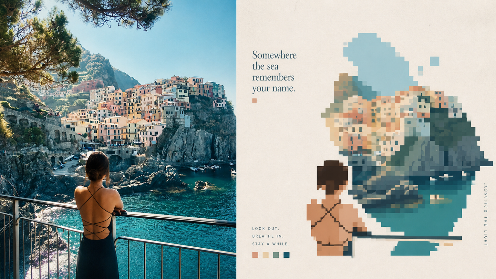
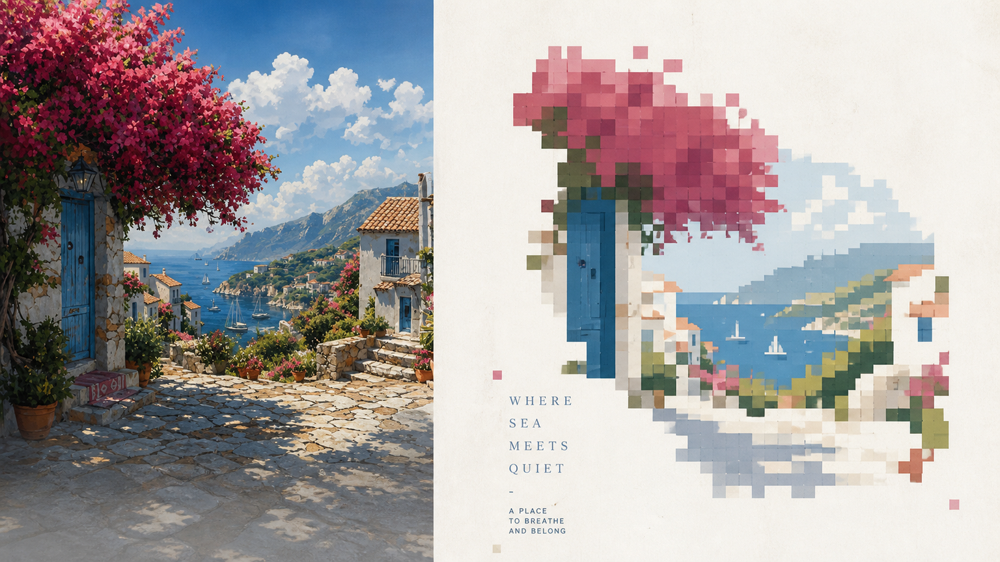
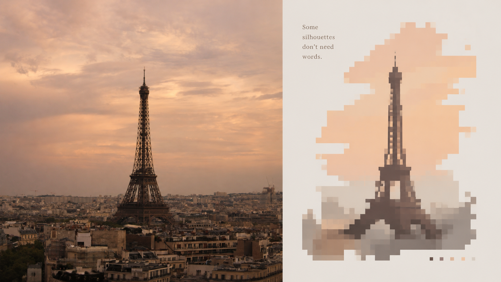
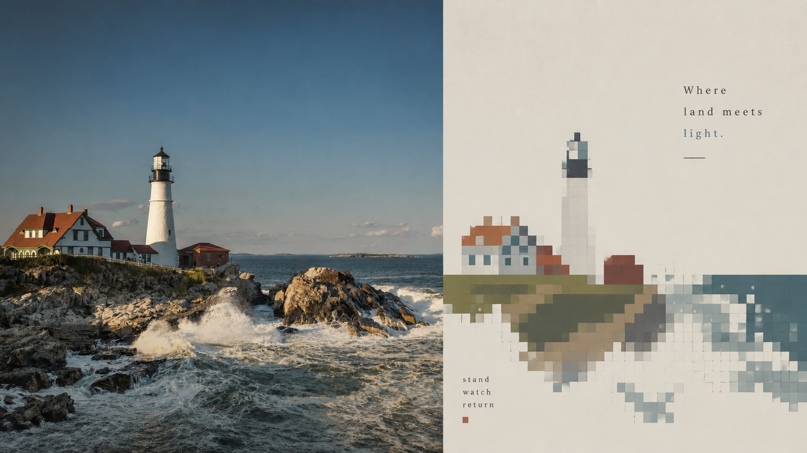
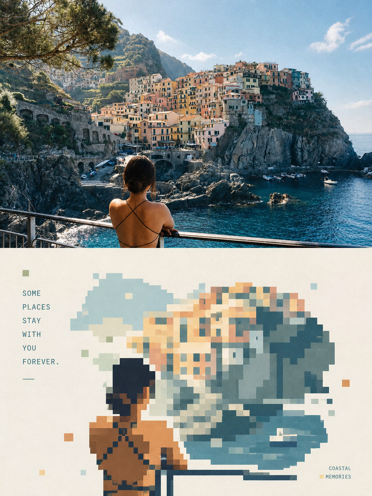
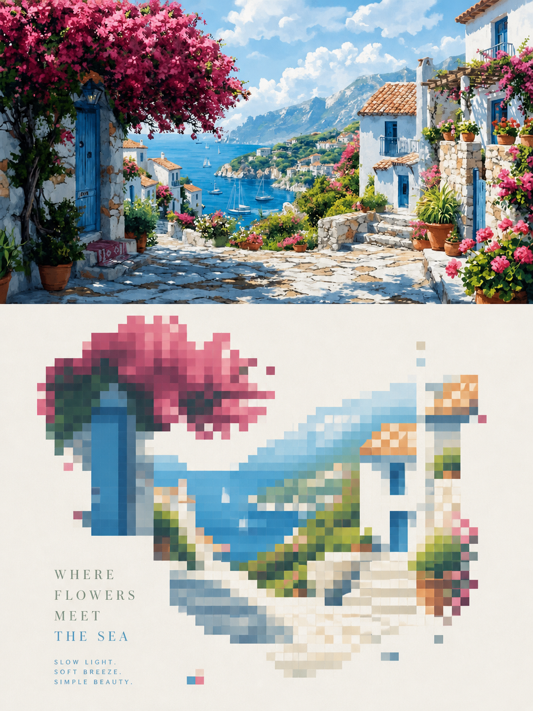
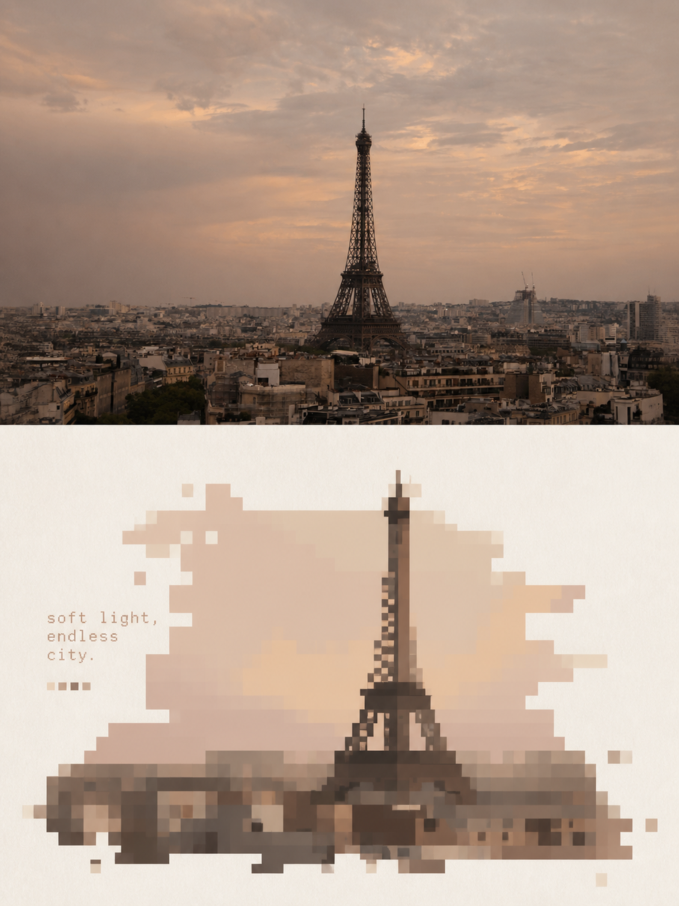
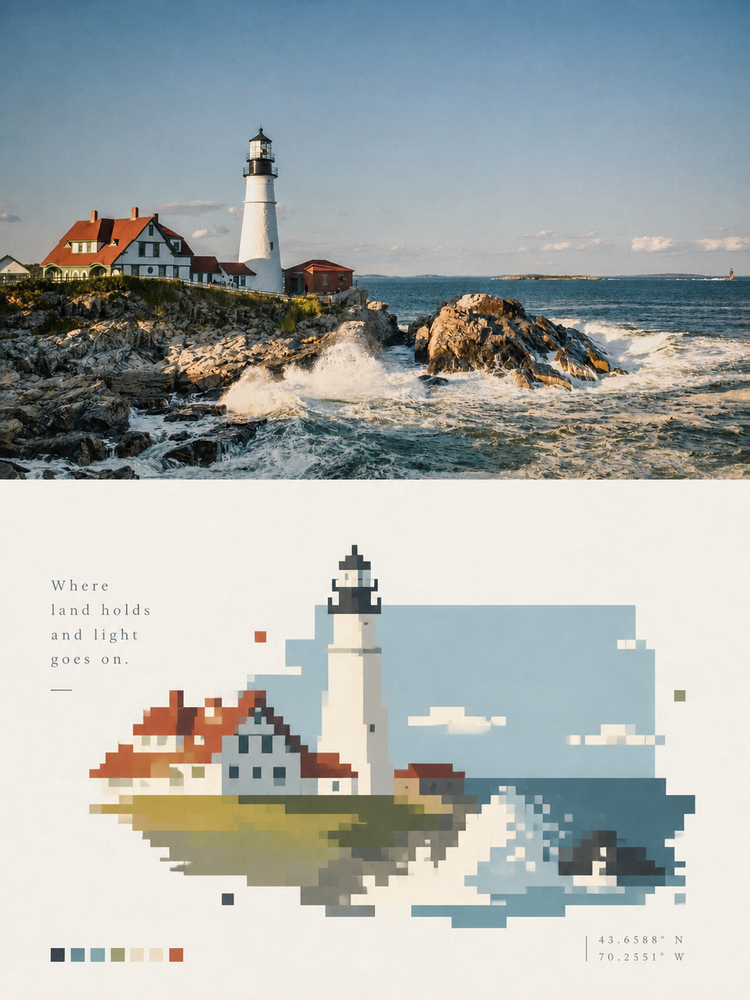

# 🦁 XXD Panel 063

### 用像素 Mask、柔和色块和负形隐喻重构照片

Panel 063 以一个核心 Mask 为视觉容器，把关键主体、动作和环境线索压缩成少量可辨认的像素形态；轻微错位与断裂负责节奏，而不是把画面推向赛博故障风。

**关键词：** 像素 Mask · 色块拼贴 · 负形嵌套 · 轻微 glitch · 大面积留白

## 使用

```text
/xxd-panel-063 photo.jpg --mode design-only --size 3:4 --text prompt --locale zh-CN
```

支持单图、目录批量、四种输出模式、多尺寸与三种文字模式。完整行为见 [SKILL.md](SKILL.md)。

## 提示词权威

[简体中文原始提示词](references/original-prompt/zh-CN.md)是运行时唯一创作与审美权威。原始 X 样张位暂留；新增样张来源见[样张清单](assets/examples/README.md)。

## 新增 16:9 左右双联样张

| | |
|---|---|
|  |  |
|  |  |

## 新增 3:4 上下双联样张

| | |
|---|---|
|  |  |
|  |  |
